  <picture>
    <!-- Mobile Dark -->
    <source
      media="(max-width: 760px) and (prefers-color-scheme: dark)"
      srcset="./assets/hero/agent-console-v5-mobile-dark.svg">
    <source
      media="(max-width: 760px)"
      srcset="./assets/hero/agent-console-v5-mobile-light.svg">
    <source
      media="(prefers-color-scheme: dark)"
      srcset="./assets/hero/agent-console-v5-dark.svg">
    <source
      media="(prefers-color-scheme: light)"
      srcset="./assets/hero/agent-console-v5-light.svg">
    
  </picture>

 

> ### _A passionate learner from SMK Telkom Malang, Banyuwangi_
>
> _Crafting code, building solutions, and contributing to the tech community_

---

Saya adalah seorang pelajar yang sangat antusias dalam dunia teknologi dan pemrograman.  
Bagi saya, coding bukan hanya sekadar menulis baris code, tetapi juga tentang membangun solusi, belajar dari error, dan berkembang setiap harinya.

Musik menjadi teman terbaik saya ketika coding — membantu saya tetap fokus, tenang, dan produktif.

---

## Languages & Tools

&nbsp;

&nbsp;

&nbsp;

&nbsp;

&nbsp;

&nbsp;

&nbsp;

&nbsp;

&nbsp;

&nbsp;

---

# GitHub Activity

---

<h2 align="center">🤝 Connect With Me</h2>

---

# 💡 Philosophy

> _"Coding adalah seni, musik adalah jiwa, dan kombinasi keduanya adalah kejutan."_

Saya percaya bahwa:

- setiap error adalah pembelajaran,
- setiap challenge adalah peluang,
- dan setiap baris code membawa saya lebih dekat menuju tujuan saya.

---

# Current Coding Playlist

<table>
<tr>
<td align="center">

</td>
<td align="center">

</td>
</tr>

<tr>
<td align="center">

</td>
<td align="center">

</td>
</tr>

<tr>
<td align="center">

</td>
<td align="center">

</td>
</tr>

<tr>
<td colspan="2" align="center">

</td>
</tr>
</table>

---

### Made with  &  by Nauval 

